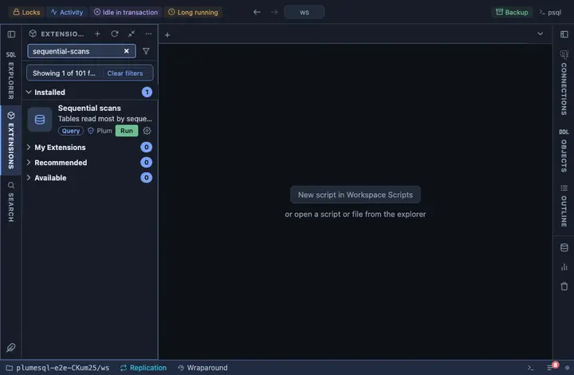

# Sequential scans

The tables read most by sequential scan, by rows read through them: the
first list to look at when a query is slow and an index might be
missing. A big table scanned often, with no index or with indexes nobody
uses, is the one to think about.

## What it shows

One row per user table with at least one sequential scan since the
statistics were last reset, the most rows read first, up to a hundred:

| Column | Meaning |
|---|---|
| schema, table | The table. |
| seq scans | How many sequential scans read it. |
| rows read by them | How many rows those scans returned in total, the cost that matters. |
| index scans | How many index scans read it, for the ratio. |
| live rows | The table's estimated live row count. |
| size | The table's size, indexes aside. |

**Its indexes** on a table opens a second grid with what the planner has
to work with there: each index, how often it was used and its size.

## Requirements

PostgreSQL 13 or newer. The counters come from `pg_stat_user_tables` and
`pg_stat_user_indexes`, so they count since the last statistics reset
(`pg_stat_reset()`) or since the server started.

## Notes

Reads only: it changes nothing on the server. Small tables are scanned
sequentially on purpose, because an index would not pay; read the rows
and the size together, not the scan count alone.
