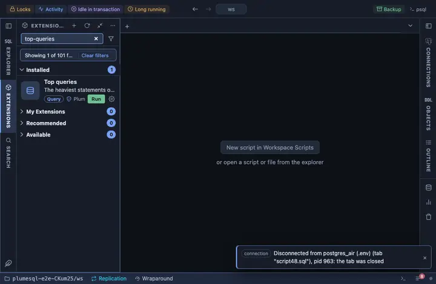

# Top queries

The heaviest statements on this database by total execution time, from
`pg_stat_statements`: calls, total and mean time, rows and the buffer
cache hit ratio, with the normalized statement text. Where the extension
runs, this is the shortest road from "the server is busy" to "this
query is why".

## What it shows

One row per distinct statement, the fifty with the most total execution
time first:

| Column | Meaning |
|---|---|
| calls | How many times it ran. |
| total ms | Total execution time, in milliseconds. |
| mean ms | Execution time per call. |
| rows | Rows returned or affected in total. |
| cache % | The share of shared buffer reads served from cache; low means it goes to disk. |
| query | The statement with constants replaced, as the extension normalizes it. |

## Requirements

PostgreSQL 13 or newer with the `pg_stat_statements` extension, which is
not on by default: `shared_preload_libraries = 'pg_stat_statements'` in
postgresql.conf, a restart, then `CREATE EXTENSION pg_stat_statements`.
Without it the run reports PostgreSQL's own error. Seeing other users'
statement texts needs the `pg_read_all_stats` role or superuser.

## Notes

Reads only. The view is deliberately not schema qualified, the one place
PlumeSQL leaves a name to the search path: it lives in whatever schema
the extension was installed into, and only the server knows which. To
start the counting again, run `select pg_stat_statements_reset()`. Not
pinned to the title bar on purpose: a pin that errors on servers without
the extension would be a dead button in prime space; where it runs, one
`@toolbar` line pins it back.
