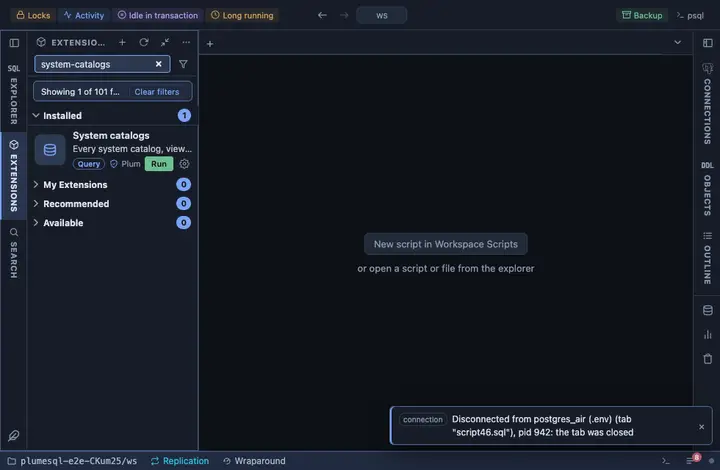

# System catalogs

Every system catalog, system view, statistics view and progress view
PostgreSQL documents, in one list with what each one holds, and any of
them browsed whole with one click. The map of the server's own
bookkeeping, for when you know roughly what you are looking for and not
which relation holds it.

## What it shows

One row per relation, grouped by family:

| Column | Meaning |
|---|---|
| relation | Its name in `pg_catalog`. |
| what | One line from the documentation: what the rows are. |
| family | `catalog`, `view`, `statistics` or `progress`. |

**Browse** on a name opens the relation itself, every row: none of these
is large enough to want a limit (pg_largeobject is the exception, and
the app's spool caps bound any runaway read and say so). The name rides
`@inline` as an identifier, quoted by the server, because a relation
name cannot travel as a bound parameter.

## Requirements

PostgreSQL 13 or newer. The list is PostgreSQL 19's; on an older server
a relation that does not exist yet answers the browse with the server's
own error, and the list itself opens everywhere.

## Notes

Reads only.
