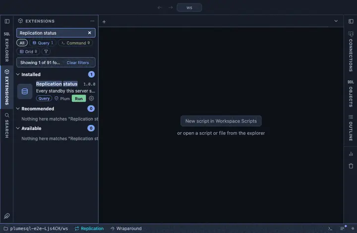

# Replication status

Every standby this server streams to and every replication slot it
holds, with the lag and the WAL each slot retains, refreshed every ten
seconds. A chip in the status bar, so the lag is a glance away.

## What it shows

One list for both halves of the question:

| Column | Meaning |
|---|---|
| kind | `standby` (a WAL sender connected now, from `pg_stat_replication`) or `slot` (from `pg_replication_slots`, whether or not anyone is connected). |
| name | The standby's application name, or the slot's name. |
| detail | A standby's state and sync mode; a slot's type and whether it is active or `INACTIVE`. |
| behind | A standby's replay lag; a slot's retained WAL, the classic disk-filler when the slot is inactive. |
| client | The standby's address, or the slot's database. |

A server with no standby and no slot answers with one row saying so.

## Requirements

PostgreSQL 13 or newer. Seeing other users' WAL senders needs the
`pg_read_all_stats` role or superuser. The retained size stays empty on
a server that is itself in recovery, where the current WAL position is
not a question it answers.

## Notes

Refreshes every 10 seconds (`@refresh 10s`) while its tab is the active
one. Ships as a chip in the status bar (`@toolbar statusbar`). Reads
only.
