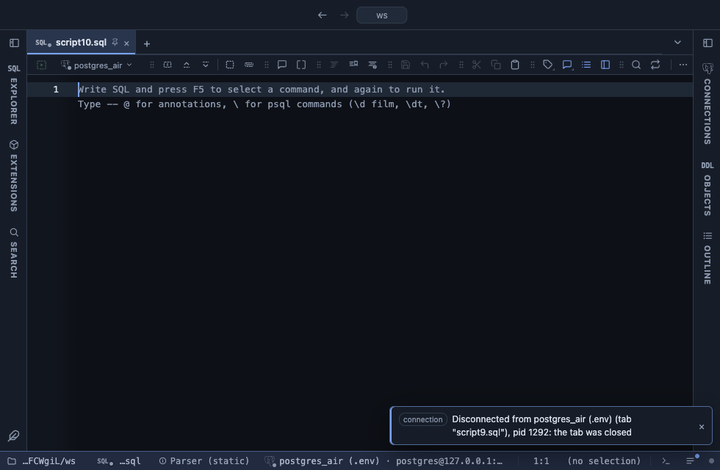

# Group by

Groups the whole result by one or more columns, with up to three folded measures and a total row, in the grid. The SQL `GROUP BY` answer to a result you already have, without writing the query again: pick the key columns and what to fold, and read the groups in the grid.

## What it shows

A **Group by** tab beside the grid, itself a grid: one row per distinct combination of the Group by columns, in the order they were picked, then one column per measure named after what it computes (`sum of price`, `mean of qty`, `rows` for a plain count). The Total row at the bottom folds the whole input with the same folds, so the total of a median is the median of every row, not a sum of medians. It stays frozen, and so do the group columns while the measures scroll. A NULL key is a group of its own.

## Inputs

| Input | `@inputs` key | Default | Meaning |
|---|---|---|---|
| Group by | `by` | none | Columns whose values form the groups, as a comma list |
| Measure 1 | `m1` | none | Column folded per group; without one, a count of rows |
| Fold 1 | `f1` | sum | count, sum, mean, median, min, max, stdev, p90 or distinct |
| Measure 2 | `m2` | none | A second folded column; blank leaves it out |
| Fold 2 | `f2` | mean | As Fold 1 |
| Measure 3 | `m3` | none | A third folded column; blank leaves it out |
| Fold 3 | `f3` | max | As Fold 1 |
| Order | `order` | by first measure | by first measure sorts largest first; by group sorts the keys; as seen keeps the order of the result |

## Requirements

PostgreSQL 13 or newer. No server side: the result's sandbox computes it from the rows already fetched. It installs with **stats-core**, the shared helper library of the Analysis extensions.

## Notes

`count` over a column counts its values and skips its nulls, like SQL's `count(col)`; `distinct` counts distinct values, NULL included as one. stdev is the sample standard deviation, p90 the 90th percentile interpolated like `percentile_cont`. Up to 100,000 groups; rows past that are left out of the groups (the Total still counts them) and the Log says how many. From a script: `-- @extension group-by` above the query, with `-- @inputs by=region, m1=amount, f1=sum` to answer the inputs in the file. A pipeline charts the groups: `-- @extension group-by | echarts` (the frozen Total row is not handed on, so the chart shows the groups alone).
