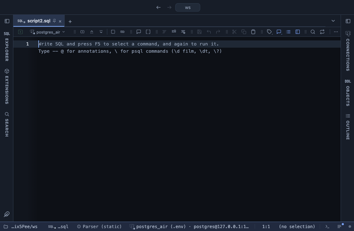

# JSON to columns

A json or jsonb column's keys as columns right beside it in the result
grid, headed `doc.name`, `doc.email` and so on. You read and filter the
document's fields without writing `doc->>'name'` for each one, and the
result stays the result: the same rows, still editable, still copied
and saved with everything else.

## What it shows

Every json and jsonb column of a result the extension applies to gets
its keys as new columns right after it. The keys are the ones found in
the first 500 rows, in the order they first appear, up to 50 per column.

Numbers stay numbers and line up on the right, nested objects and arrays
read as compact JSON, a missing key is the grid's NULL, and a JSON `null`
reads as a dimmed `null`, so a filter can tell the two apart. They are
computed columns: you can sort and filter on them, and they copy and
save with the rest.

## Requirements

PostgreSQL 13 or newer. Nothing runs on the server: the keys are read
from the rows already fetched.

## Notes

A key that first shows up after row 500 gets no column, and a document
with more than 50 keys shows the first 50; the Log says when keys were
left out.

To follow a path into the document, or to turn an array into one row
per element, use JSON to rows: it builds a table of its own in a tab.

To use it from a script, put `-- @extension json-to-columns` above the
query. On a result you can also turn it on from the result's own menu.
The extension's page has the line ready to copy.
