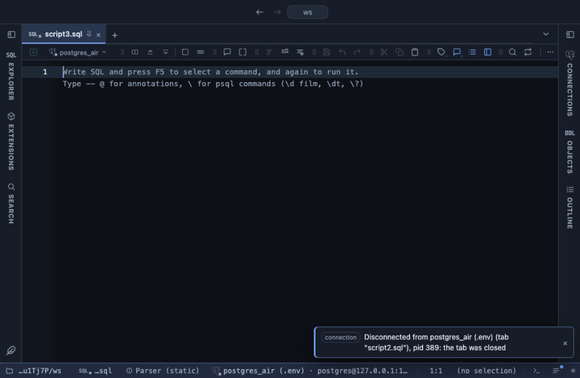

# JSON to rows

A json or jsonb column as a table of its own, in a tab beside the
result: a column per key, a path to follow into the document, and an
array opened into one row per element. Reach for it when the JSON holds
a list (order lines, tags, events) that you want to read as rows.

## What it shows

A **JSON rows** tab beside the grid, itself a grid. The keys come in the
order they are first seen across the rows, up to 100 of them. Numbers
and booleans keep their type, so they align and sort as numbers; a
nested object or array reads as compact JSON text. A key a row does not
have is the grid's NULL, and a key whose value is JSON `null` reads as a
dimmed `null`. A value that is not an object (a number, a string) lands
in a `value` column.

With a path the view opens that object instead of the top level:
`address` opens `doc->'address'`, `meta.tags` goes two levels down. When
the value at the path is an array, each element becomes a row of its
own, next to the columns of the row it came from.

The result's other columns stay in front, the first one frozen at the
start, unless you drop them. The view reads the whole result.

## Inputs

| Input | `@inputs` key | Default | Meaning |
|---|---|---|---|
| JSON column | `column` | asked | The json or jsonb column to open |
| Path | `path` | none | A dot path to open instead of the top level, like address or meta.tags |
| Other columns | `keep` | keep | `keep` shows the result's other columns first; `drop` shows the JSON alone |
| Arrays | `explode` | one row per element | An array at the path gives a row per element, or stays one cell of JSON text |

## Requirements

PostgreSQL 13 or newer. Nothing runs on the server: the table is built
from the rows already fetched.

## Notes

Keys past the first 100 are left out, and the Log says so. A key with
the same name as one of the kept columns shows as `name (2)`, so both
stay visible. A key with a dot in its name cannot be reached by the
path, because the path splits on every dot.

For a quick look at the keys without a new table, JSON to columns adds
them as columns right in the result.

To use it from a script, put `-- @extension json-to-rows` above the
query (add `open`, `only` or `beside` to choose how the tab opens), and
`-- @inputs` to answer the inputs in the file instead of the dialog. On
a result you can also turn it on from the result's own menu. The
extension's page has these lines ready to copy.
