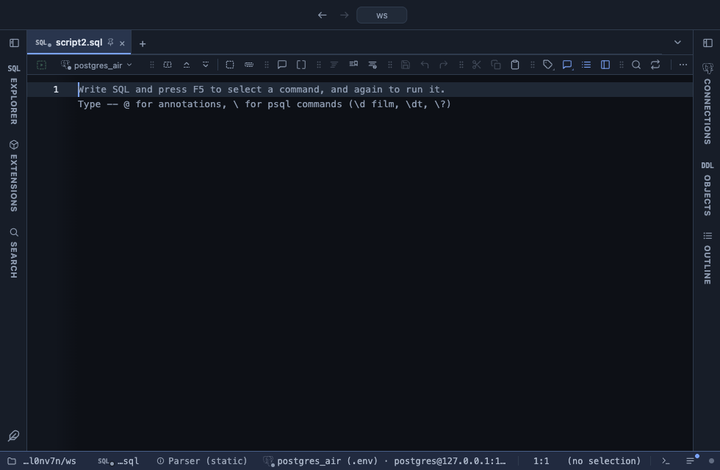

# Rows as SQL

The result's rows as SQL statements, to copy, to save to a file or to read in a tab: an INSERT per row, INSERTs of many rows at once, an UPDATE per row by its key, or an upsert. Handy for moving a few rows from one database to another, writing a seed file, or turning what you just looked at into a migration. Hand written, no library.

## What it shows

A **SQL** tab beside the grid with the statements in a monospace panel, and a line above them saying how many statements were written for how many rows. The header has two buttons: **Copy** copies every statement, **Copy first 100 rows** only those for the first hundred.

The values are written as PostgreSQL reads them back: text with its quotes doubled, NULL as `NULL`, numbers bare, booleans as `true` and `false`. A json or jsonb value, an array, a uuid, a date, a time, a timestamp, an interval and a network address carry an explicit cast (`'{"a":1}'::jsonb`, `'{x,y}'::text[]`), so the statement says what it holds even pasted outside an INSERT. Column and table names are quoted only where they must be.

| Statements | What you get |
|---|---|
| insert | `insert into t (a, b) values (...);` for every row |
| multi-row insert | one `insert ... values (...), (...), ...;` per batch of rows |
| update | `update t set b = ... where a = ...;` for every row, the key columns in the WHERE (`is null` for a NULL key) |
| upsert | `insert ... on conflict (a) do update set b = excluded.b;` for every row, or `do nothing` when every column is a key |

## In Copy As and Save As

The extension also adds four formats to every result grid: **SQL INSERT**, **SQL multi-row INSERT** (100 rows a statement), **SQL UPDATE** and **SQL upsert**. Pick one under Copy As or Save As in the result's dots menu (or the menu of a cell, a row or a column) to copy or save the selection, or everything when nothing is selected, without opening the tab. Pick one under Copy Format and the copy shortcut uses it from then on.

These formats need no inputs. They write to the table the result was read from when PlumeSQL knows it (a query on one table) and use that table's primary key for an UPDATE or an upsert. For anything else (a join, an expression) the statements write to `my_table`, and an UPDATE or an upsert stops with a line in the Log asking for the SQL tab, where you pick the table and the key yourself.

## Inputs

| Input | `@inputs` key | Default | Meaning |
|---|---|---|---|
| Target table | `table` | my_table | The table the statements write to, schema qualified if you like (public.film) |
| Statements | `kind` | insert | One INSERT per row, INSERTs of many rows, an UPDATE per row by its key, or INSERT ... ON CONFLICT DO UPDATE |
| Key columns | `keys` | none | The columns that identify a row: the WHERE of an UPDATE, the conflict target of an upsert |
| Rows per INSERT | `batch` | 100 | For a multi-row insert, how many rows one statement carries |
| Top rows | `top` | 10000 | How many rows the view reads from the result, from the first one; the rest are left out |

## Requirements

PostgreSQL 13 or newer. No server side: the result's sandbox writes the SQL from the rows already fetched. The statements are only text: nothing is run, here or anywhere.

## Notes

In the SQL tab you type the target table yourself, whatever the result
was read from; a name with a double quote in it is used exactly as
typed. An upsert needs a unique index or constraint on its key columns
in the target table.

A column that appears twice in the result is written once. A generated
or identity column is written like any other, so leave it out of the
query if the target fills it in itself.

The panel shows the first 400,000 characters of a long script; Copy
still copies all of it.

To use it from a script, put `-- @extension rows-as-sql` above the
query (add `open`, `only` or `beside` to choose how the tab opens), and
`-- @inputs` to answer the inputs in the file instead of the dialog. On
a result you can also turn it on from the result's own menu. The
extension's page has these lines ready to copy.
