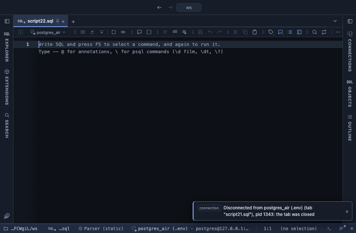

# Unpivot

Turns columns into rows: one row per kept key and melted column, a name and a value, over the whole result, in the grid. The reverse of a pivot: a wide table with one column per month or per metric becomes the long shape a chart or a further group by wants.

## What it shows

An **Unpivot** tab beside the grid, itself a grid: for every row of the result and every melted column, one row holding the kept columns, the melted column's name and its value. A result of 100 rows with 12 melted columns becomes 1,200 rows. The value column is numeric when every melted column is numeric, and text otherwise, so a mix of numbers and names still fits in one column.

## Inputs

| Input | `@inputs` key | Default | Meaning |
|---|---|---|---|
| Keep | `keep` | none | Identifier columns repeated on every output row, as a comma list |
| Columns to melt | `columns` | every column not kept | Columns turned into name and value rows, as a comma list |
| Name column | `names` | name | The header of the column holding the melted column names |
| Value column | `values` | value | The header of the column holding their values |
| Skip nulls | `skip` | no | yes leaves out the rows whose value is null |

## Requirements

PostgreSQL 13 or newer. No server side: the result's sandbox computes it from the rows already fetched. It installs with **stats-core**, the shared helper library of the Analysis extensions.

## Notes

Up to 1,000,000 output rows; the rest are left out and the Log says how many. In SQL the same is a `CROSS JOIN LATERAL (VALUES ...)`; this is for a result you already have. From a script: `-- @extension unpivot` above the query, with `-- @inputs keep=month, columns=north, south, east`. The long shape feeds the other views: `-- @extension unpivot | group-by` or `-- @extension unpivot | echarts`.
