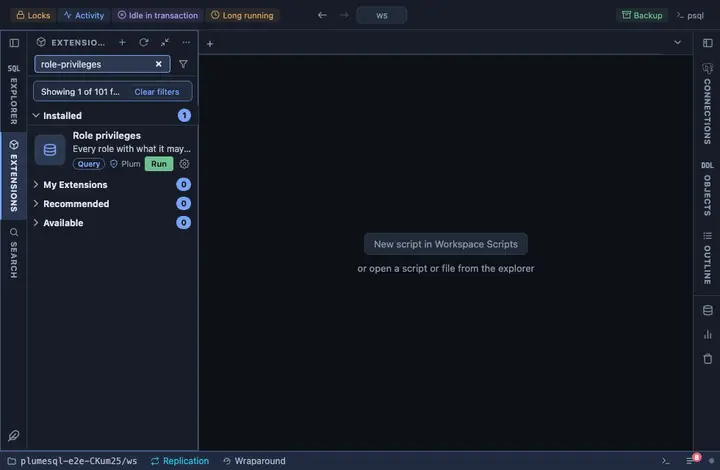

# Role privileges

Every role with what it may do and which roles it is a member of; for
any role, every explicit grant to it across databases, schemas,
relations, columns and routines, and its members; and the grants and
memberships managed where they show, with a confirmation each. The
roles chapter of a server, on one page.

## What it shows

One row per role:

| Column | Meaning |
|---|---|
| role | Its name. |
| superuser, can log in, create db, create role, replication, bypass rls | Its attributes, `yes` where set. |
| conn limit | Its connection limit, when one is set. |
| valid until | When its password expires, when set. |
| member of | The roles it is a member of. |

**Privileges** on a role opens every EXPLICIT grant to it, one row per
object: kind, object, the privileges, whether they came with grant
option, and who granted them. Built-in roles and defaults are not
grants: an object with an empty ACL runs on owner defaults and lists
nothing, and what PUBLIC holds is a grant to PUBLIC. A role with no
grant anywhere says so in one row.

**Members** on a role opens who is in it: each member, whether it may
grant the role onward (admin option), whether it can log in, and who
granted the membership.

## Buttons

- On the privileges grid, a relation row's **revoke all** revokes every
  privilege on that table or view from the role; the other kinds stay
  read-only there. **grant select** and **grant all** ask which schema
  and relation (each with a pick) and grant to the role.
- On the members grid, **revoke membership** removes a member; on the
  roles list, **grant membership** asks which role to add as a member.

Each button asks first. Names ride `@inline`, quoted by the server
itself, since GRANT and REVOKE bind nothing.

## Requirements

PostgreSQL 13 or newer. Reading the ACLs needs no privilege. Granting
and revoking need the privilege with grant option or ownership, and
memberships need ADMIN OPTION on the role or CREATEROLE.

## Notes

The lists read only; the buttons write, each after a confirmation. A
revoke takes grants, never the object: the owner keeps owning, and the
role keeps what it holds through PUBLIC, through its member roles, or
per column.
