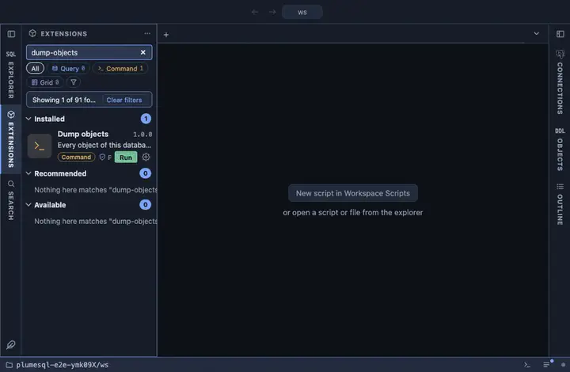

# Dump objects

Every object of the connected database into a directory tree, one file
per object, byte for byte as pg_dump and pg_restore print it:
`<schema>/<type>/<name>.sql`. A database's schema as files, ready for a
repository, a diff or a review.

## What it does

Asks where the tree goes (a directory pick), confirms, then runs
PlumeSQL's own `plumesql dump-tree` on the tab's connection in a
terminal of its own. The tree is pg_restore's rendering cut at the TOC
headers it writes between objects: nothing reformatted and nothing
filtered. An earlier run's tree at the same place is overwritten, which
the question says. An alert reports success, or that the terminal has
why and the tree is missing or incomplete.

## Inputs

| Input | Default | Meaning |
|---|---|---|
| out | asked | The directory the tree goes under. |
| tree | `{out}/{db}-objects` | The tree's own directory, declared once so the question, the report and the command name the same place. |

The connection travels the way every PostgreSQL tool takes it, through
the `PG*` environment variables, the password among them and nowhere
else.

## Requirements

Nothing to install: the command is PlumeSQL itself. It runs pg_dump and
pg_restore internally, so a PostgreSQL client installation not older
than the server's must be on this machine (System, Client tools). A
connection whose user may read every object. PostgreSQL 13 or newer.

## Notes

A command extension: it runs a program on your machine. It asks before
it runs (`@confirm`). PlumeSQL's own DDL snapshot (the Objects side tab)
renders the same objects on its own; this tree is the tools' rendering,
for when byte-exact pg_dump output is what a repository wants.
