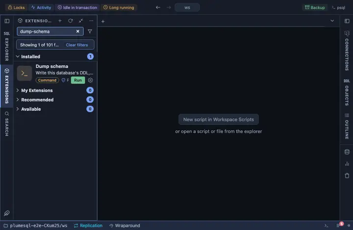

# Dump schema

Write the connected database's DDL, without a row of data, to a plain
SQL file, and open it. For reading, diffing and carrying a schema
elsewhere; the Backup extension is the one for data.

## What it does

Runs `pg_dump --schema-only` on the tab's connection, in a terminal of
its own, and writes `<database>-ddl-<timestamp>.sql` into the workspace;
the file opens in a tab the moment it is written. Named once with the
moment it was taken, so a second run never overwrites the first, and
what opens is what was written.

## Inputs

| Input | Default | Meaning |
|---|---|---|
| file | `{db}-ddl-{timestamp}.sql` | The file's name in the workspace, declared once so the command and the opened file cannot disagree. |

The password reaches pg_dump through the environment (`@env
PGPASSWORD={password}`), never the command line.

## Requirements

`pg_dump` on this machine, at a version not older than the server's:
PlumeSQL finds every PostgreSQL client installation (System, Client tools, which also installs a missing one) and runs the one that suits the server, so nothing has to be on the PATH. A connection whose user may read every object. PostgreSQL 13 or
newer.

## Notes

A command extension: it runs a program on your machine, not a query on
the server. Plain SQL format, for reading.
