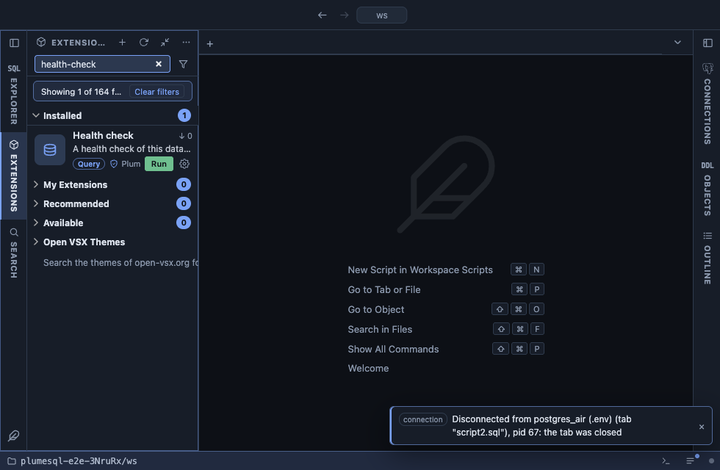

# Health check

A health check of the database you are connected to, as a checklist:
every finding with a severity, what was found and what to do about it,
and the checks that found nothing as `ok` lines at the end. It covers
the problems that stay quiet until they cause an outage: transaction ID
wraparound, integer keys running out, invalid indexes, long
transactions, missing primary keys and indexes, dead rows and stale
statistics. Run it on a database you have just inherited, or before a
release.

## What it shows

One row per finding, `high` first, then `medium`, `low` and the passed
checks:

| Column | Meaning |
|---|---|
| severity | `high`, `medium`, `low`, or `ok` for a check with no finding. |
| check | Which check found it. |
| object | The database, table, index, sequence, slot or session (`pid`). |
| finding | What is wrong, with the numbers behind it. |
| what to do | The remedy. |

The checks and where they draw the line:

| Check | Finds |
|---|---|
| transaction wraparound | Databases whose oldest unfrozen transaction ID is more than 1 billion transactions old (`medium`; `high` past 1.5 billion, of the 2 billion where the server stops accepting writes), and `low` once it is 20% past `autovacuum_freeze_max_age`. |
| integer overflow | Sequences, and the `smallint` or `integer` columns they feed, past 50% of their range (`medium`; `high` from 75%). A sequence feeding an integer column is measured against the column's limit, not its own. Integer overflow risk lists every key in detail. |
| invalid indexes | Indexes marked invalid, usually left behind by a failed `CREATE INDEX CONCURRENTLY`. Always `high`: they are updated on every write and never used. |
| long transactions | Client sessions whose transaction has been open for more than an hour (`high` past six hours). |
| idle in transaction | Sessions idle inside an open transaction for more than five minutes (`high` past an hour). |
| replication slots | Inactive replication slots, with the WAL they keep. |
| connections | Client connections at 80% of `max_connections` or more (`high` from 90%). |
| cache hit ratio | This database's buffer cache hit ratio when it is below 99% (`medium` below 90%), once it has read at least 100,000 blocks. |
| primary keys | User tables without a primary key; `medium` above about 10,000 rows. Partitions are left out, they follow their parent. |
| foreign keys without an index | Foreign keys whose referencing columns no index starts with; `medium` above about 10,000 rows. |
| dead rows | Tables with more than 10,000 dead rows making up more than 20% of the table (`high` when the dead outnumber the live). |
| stale statistics | Tables over 10,000 rows that were never analyzed, or where more than 20% of the rows changed since the last analyze. |
| unused indexes | Indexes of 1 MB or more that nothing has read since the statistics were reset, leaving out unique, primary key and constraint indexes (`medium` from 100 MB). |

## Requirements

PostgreSQL 13 or newer. Any role can run it. Without `pg_read_all_stats`
(or superuser) the session checks only see your own sessions, and the
other checks only the tables you may read.

## Notes

Reads only: nothing is vacuumed, analyzed, dropped or changed here.
The thresholds are a first ordering, not a verdict: a table without a
primary key may be a log on purpose, and an unused index may serve a
standby or a monthly report, since the counters here are this server's
since their last reset. Security review is the companion checklist for
roles, passwords and access.
