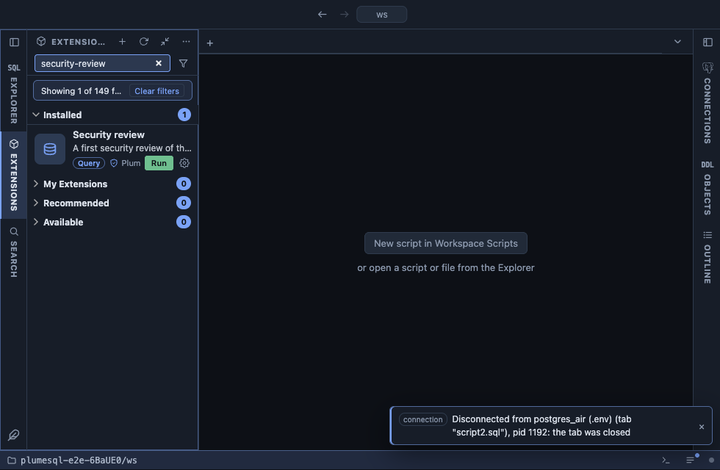

# Security review

A first security review of the server, as a checklist: every finding
with a severity, what was found and what to do about it, and the checks
that found nothing as `ok` lines at the end. It covers what a reviewer
looks at first; it is a starting point, not an audit.

## What it shows

One row per finding, `high` first, then `medium`, `low`, `info` and the
passed checks:

| Column | Meaning |
|---|---|
| severity | `high`, `medium`, `low`, `info`, or `ok` for a check with no finding. |
| check | Which check found it. |
| object | The role, schema, database, function, table, setting or pg_hba.conf line. |
| finding | What is wrong, in a few words. |
| what to do | The remedy, as a statement or a setting to change. |

The checks:

| Check | Finds |
|---|---|
| superusers | Every superuser: `high` for one that can log in, `medium` for the bootstrap superuser, `low` for one that cannot log in. |
| powerful attributes | Roles with CREATEROLE, CREATEDB, BYPASSRLS or REPLICATION that are not superusers. |
| file and program access | Members of `pg_read_server_files`, `pg_write_server_files` and `pg_execute_server_program`, which reach the server's files and shell. |
| password expiry | Login roles without VALID UNTIL. |
| passwords | Login roles whose password is an md5 hash, and login roles with no password at all. |
| client authentication | `pg_hba.conf` lines using `trust` (`high` over the network), `password` (clear text) or `md5`. |
| public schema | CREATE on the `public` schema granted to PUBLIC, the default before PostgreSQL 15. |
| schemas | Any other schema where PUBLIC may create objects. |
| databases | Databases every role may connect to or create temporary tables in, the default. |
| security definer functions | SECURITY DEFINER functions with no `search_path` of their own; `high` when a superuser owns them. |
| row level security | Tables that have policies but row level security disabled, so the policies do nothing. |
| settings | `ssl` off, `password_encryption` md5, `log_connections` and `log_disconnections` off, `fsync` off. |

## Requirements

PostgreSQL 13 or newer. It runs for any role, but two checks read what
only a superuser may: the passwords (`pg_authid`) and the client
authentication lines (`pg_hba_file_rules`). Without the privilege those
two checks answer with an `info` line saying they were skipped, and the
rest of the review runs as usual. They are read through `query_to_xml`
only when the privilege is there, which needs a server built with XML
support, as every common distribution is.

## Notes

Reads only: nothing is granted, revoked or changed here. Severities are
a first ordering, not a verdict: a superuser that can log in is normal
on a development machine and a finding on production, and `trust` on
the local socket of a single-user container is a choice. Role privileges
shows what each role may do in detail.
