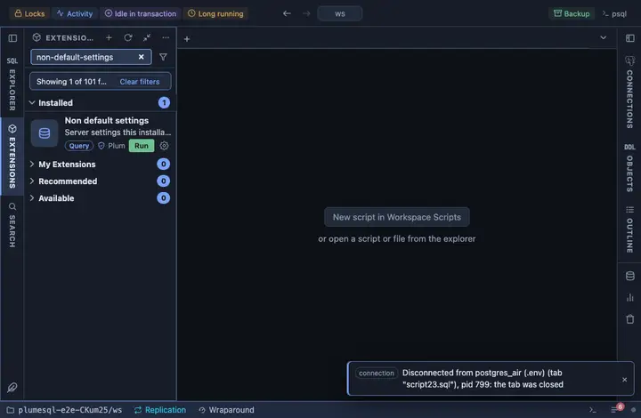

# Non-default settings

Every server setting this installation changed from the value the server
was built with, and where each value came from. The shortest answer to
"how is this server configured": what someone decided, without the
hundreds of parameters still at their defaults.

## What it shows

One row per changed setting, alphabetically:

| Column | Meaning |
|---|---|
| name | The parameter. |
| setting, unit | Its value now. |
| source | Who set it: `configuration file`, `command line`, `environment variable`, `database` or `user` (per-role or per-database settings). |
| from file | The configuration file it came from, when it did. |

Changed means the value differs from the shipped default (`boot_val`),
so a line initdb wrote at the default (shared_buffers, DateStyle and a
few more come that way) is not listed. Settings set for one session
(`client`, `session`), which would include what PlumeSQL itself sends
when it dials, are left out too.

**Where it comes from** on a name opens the setting's card: what it
does, the value now, the shipped default, the value on reset, who set
it, the file and line, and when a change can take effect.

## Requirements

PostgreSQL 13 or newer. Reading `pg_settings` needs no privilege; the
source file and line show only to superusers and members of
`pg_read_all_settings`.

## Notes

Reads only: use Server settings to change one.
