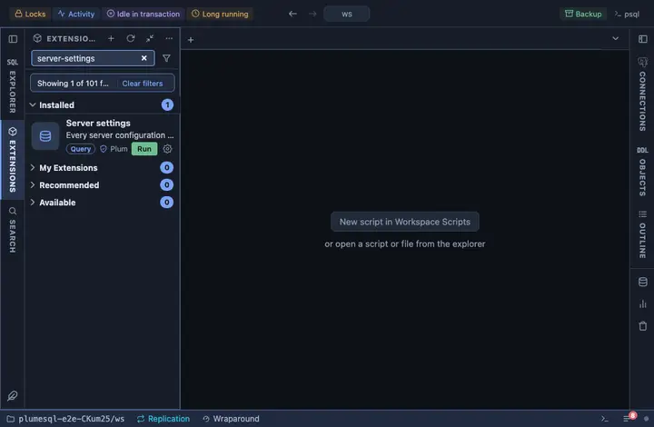

# Server settings

Every configuration parameter of the server with its value and what
changing it takes, grouped by category; a card per parameter one click
away; and Set value, Reset and Reload as row buttons, so a parameter is
changed through `ALTER SYSTEM` and applied without leaving the grid.

## What it shows

One row per parameter, by category then name:

| Column | Meaning |
|---|---|
| name, value, unit, type | The parameter and its value now. |
| when it can change | Its context: `postmaster` needs a restart, `sighup` a reload, `superuser`, `user` and the rest a SET. |
| source | Who set the current value. |
| restart pending | `yes` when a new value is written and waits for a restart. |
| category | PostgreSQL's own grouping. |

**What it is** on a name opens the parameter's card: description, type,
allowed values or range, the value now, the shipped default, the value
on reset, source, file and line, context, and whether a restart is
pending.

## Buttons

- **set value** asks for the new value and writes it with `ALTER SYSTEM
  SET`, which validates it before writing a word: a value the parameter
  cannot take is refused in the server's own words. The write lands in
  `postgresql.auto.conf` and takes effect on Reload, or on a restart
  where the context says `postmaster`.
- **reset** removes the parameter from `postgresql.auto.conf`; what
  `postgresql.conf` and the shipped default say returns on the next
  Reload.
- **reload** asks the server to re-read its configuration files
  (`pg_reload_conf()`): every parameter a reload can apply takes its new
  value at once, the postmaster ones keep waiting for a restart.

Each button asks first. The name and the value ride `@inline`, quoted by
PostgreSQL itself, never pasted into the statement.

## Requirements

PostgreSQL 13 or newer. `ALTER SYSTEM` and `pg_reload_conf()` need
superuser, or a role granted `ALTER SYSTEM` on the parameter
(PostgreSQL 15 and newer) and EXECUTE on the function; a hosted service
may withhold both.

## Notes

The list reads only; the three buttons write, and each asks first. The
reload is server wide, as a reload always is; the answer names the row
it was asked from.
