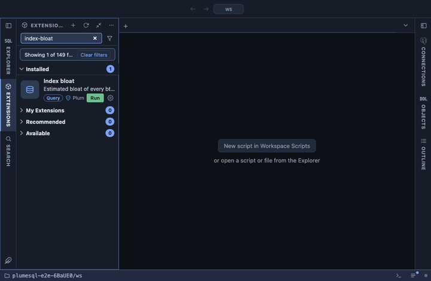

# Index bloat

Estimated bloat of every btree index, the most wasted space first: how
big the index is, how much of it the entries would not need, and that
share as a percentage. The estimate is the well known one computed from
the planner's statistics, so it needs no extension and reads no index.

## What it shows

One row per btree index whose estimate says it holds more pages than its
entries need:

| Column | Meaning |
|---|---|
| schema, table, index | The index and its table. |
| size | Its pages, as the last VACUUM or ANALYZE counted them. |
| wasted | The pages beyond what the entries need at the index's fillfactor. |
| bloat % | The wasted share of the size. |
| fillfactor | The index's fillfactor (90 by default for btree); the space it keeps free on purpose is not counted as waste. |
| entries (est.) | The entry count the estimate works from. |
| definition | The CREATE INDEX statement, to rebuild it by. |

## How the estimate works

For every indexed column it takes the average width and null fraction
from `pg_stats` (an expression index's own statistics for an
expression), builds the size of an average index entry with its header
and alignment, and derives the leaf pages the entries need at the
index's fillfactor. What the index has beyond that is the waste. Indexes
whose columns the statistics do not cover are left out rather than
guessed at.

The estimate knows nothing of btree deduplication (PostgreSQL 13 and
newer), which stores repeated values once: an index on a column with
few distinct values can be much smaller than the estimate, and then it
does not show at all. The figure is a lower bound there, never an
exaggeration.

## Requirements

PostgreSQL 13 or newer. `pg_stats` shows only the columns the current
role may read, so a role that cannot read a table does not see its
indexes; the system catalogs show for a superuser.

## Notes

Reads only: nothing is rebuilt here. `REINDEX INDEX CONCURRENTLY` (from
the definition's name) rebuilds an index without blocking writes and
returns the waste to the operating system.
