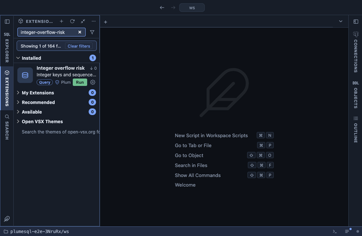

# Integer overflow risk

Integer keys and sequences by how much of their range is used, with the
statement that moves them to bigint. An `integer` key stops at
2,147,483,647 and a `smallint` one at 32,767; the insert after that
fails, every time, until the column is changed. This shows how close
each one is, so the change happens on a quiet afternoon and not during
an outage.

## What it shows

One row per `smallint` or `integer` column that is a primary key, a
foreign key, an identity or fed by a sequence, and per integer sequence
no such column owns, the fullest first:

| Column | Meaning |
|---|---|
| object | `schema.table.column`, or `schema.sequence` for a sequence of its own. |
| type | `smallint` or `integer`. |
| fed by | `identity`, `serial` (a sequence the column owns), `key` (a primary or foreign key with no sequence) or `sequence`. |
| current | The sequence's last value, or the largest value in the column. |
| maximum | The largest value the type holds. |
| % used | How much of the range is used. |
| room left | How many values are left. |
| note | Why a row has no numbers: `not used yet` for a sequence that never gave a value, `not read: no index leads with the column` for a key column that only a full table scan could measure. |
| move to bigint | The statement that removes the limit: the `ALTER TABLE ... TYPE bigint`, and for a serial column the `ALTER SEQUENCE ... AS bigint` its sequence needs too. |

## Inputs

| Input | Default | Meaning |
|---|---|---|
| Show from (percent used) | 0 | Leave out everything below this percentage. |

## Requirements

PostgreSQL 13 or newer. A column you may not read is listed without
numbers.

## Notes

Reads only, and cheaply: a column fed by a sequence is measured by its
sequence, and any other key column by `max()` only when an index starts
with it, so the answer comes from the index and the table is never
scanned. The statements in the last column are not run here. Changing a
column's type rewrites the table under an exclusive lock, so plan it for
a maintenance window on a large table. Health check flags the same
risks from 50% on, beside its other checks.
