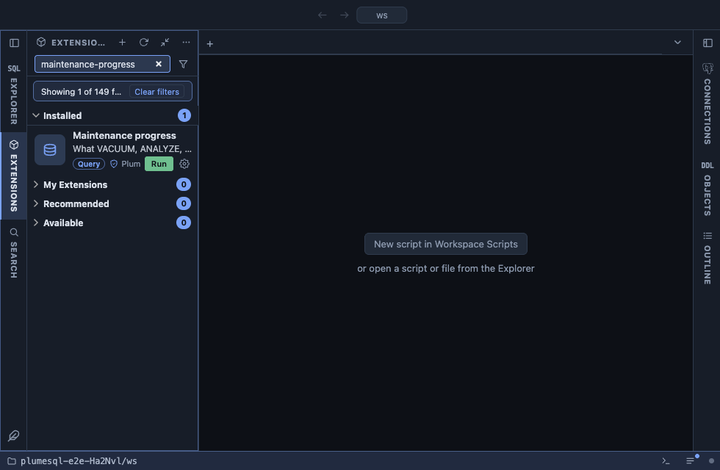

# Maintenance progress

What VACUUM, ANALYZE, CREATE INDEX and CLUSTER are doing right now, on
every database of the server, with how far along each one is, refreshed
every three seconds while the tab is visible. Autovacuum's own work
shows here too, which is often the answer to "why is the disk busy".

## What it shows

One row per running operation, from the `pg_stat_progress_*` views,
the longest running first:

| Column | Meaning |
|---|---|
| pid | The backend doing the work. |
| command | `VACUUM`, `ANALYZE`, `CREATE INDEX`, `CREATE INDEX CONCURRENTLY`, `REINDEX`, `CLUSTER` or `VACUUM FULL`. |
| database, relation | Where it works. The relation is named for this database; elsewhere it shows its oid. |
| phase | The phase PostgreSQL reports, verbatim. |
| done % | How far along the current phase is, where the counters allow it: heap blocks for VACUUM and CLUSTER, sample blocks for ANALYZE, blocks or tuples for CREATE INDEX. A CLUSTER through an index counts tuples against the table's row estimate and stops at 99.9 until it is done. Empty where nothing measures it. |
| detail | The raw counters behind the percentage. |
| running for | Since the statement started. |
| started by | The user, or `autovacuum`. |
| query | The statement, verbatim. |

**Cancel** on a row asks first, then runs `pg_cancel_backend()` on its
pid. The operation stops where it is; a cancelled
`CREATE INDEX CONCURRENTLY` leaves an invalid index behind to drop, and
a cancelled autovacuum simply comes back later.

## Requirements

PostgreSQL 13 or newer. Seeing other users' statements needs the
`pg_read_all_stats` role or superuser; cancelling another user's backend
needs `pg_signal_backend` or superuser.

## Notes

Refreshes every 3 seconds (`@refresh 3s`), only while its tab is the
active one. The percentage follows the phase: a VACUUM counts heap
blocks scanned, then stands still while it vacuums the indexes (the
index passes count in the detail), then counts blocks vacuumed; a
CREATE INDEX counts blocks while it scans the table and tuples while it
sorts and loads them. Opens on its result (`@face result`).
