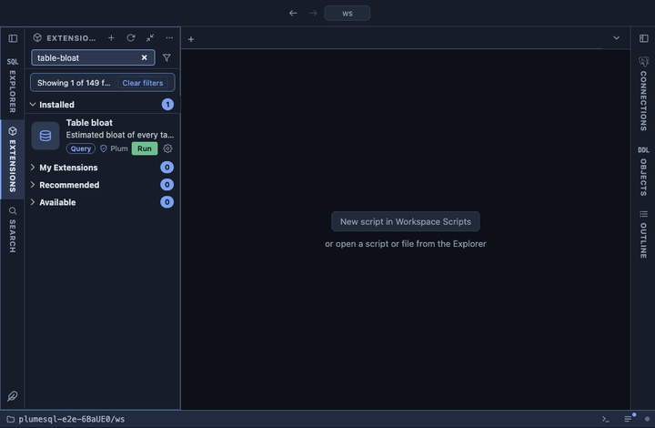

# Table bloat

Estimated bloat of every table, the most wasted space first: how big
the table is, how much of it the live rows would not need, and that
share as a percentage. The estimate is the well known one computed from
the planner's statistics, so it needs no extension and reads no table:
it costs a catalog query, whatever the size of the database.

## What it shows

One row per table or materialized view whose estimate says it holds
more pages than its rows need:

| Column | Meaning |
|---|---|
| schema, table | The table. |
| size | Its heap and TOAST pages, as the last VACUUM or ANALYZE counted them. |
| wasted | The pages beyond what the live rows need at the table's fillfactor. |
| bloat % | The wasted share of the size. |
| fillfactor | The table's fillfactor; the space it keeps free on purpose is not counted as waste. |
| rows (est.) | The row count the estimate works from. |
| last vacuum | The later of the manual and the automatic run, or `never`. |

**Columns** on a table opens the inputs of its estimate, one row per
column: its type, the average width and null share the statistics hold,
and its storage. A column with `no statistics` is where an odd figure
comes from.

## How the estimate works

From `pg_stats` it takes each column's average width and null fraction,
builds the size of an average row with its header and alignment, and
divides the page size by it: that gives the pages the live rows need at
the table's fillfactor, plus a share for TOAST. What the table has
beyond that is the waste. It is an estimate, as good as the last
ANALYZE: a table never analyzed, or one with a column the statistics do
not cover (a `name` column, a column nobody may read), is left out
rather than guessed at.

## Requirements

PostgreSQL 13 or newer. `pg_stats` shows only the columns the current
role may read, so a role that cannot read a table does not see its
estimate; the system catalogs show for a superuser.

## Notes

Reads only: nothing is vacuumed or rewritten here. A plain VACUUM makes
the waste reusable by new rows but rarely returns it to the operating
system; `VACUUM FULL` or `CLUSTER` does, under an exclusive lock, and
`pg_repack` without one. A table that bloats again after every cleanup
needs autovacuum to run more often on it, not a bigger cleanup.
