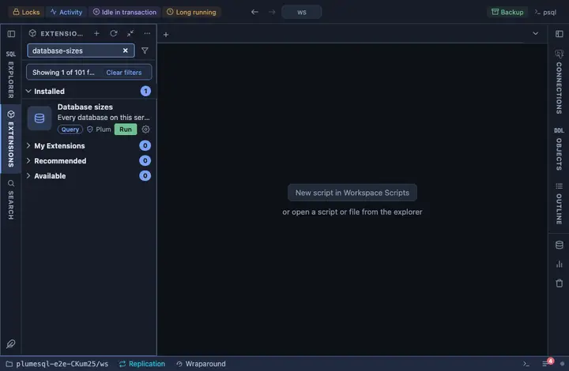

# Database sizes

Every database on this server by size, with how many backends it has
right now, its owner and whether it is a template. Pinned under the
right strip's tabs, beside the object tree it talks about.

## What it shows

One row per database, largest first:

| Column | Meaning |
|---|---|
| database | Its name. |
| size | On disk, all in; empty where the connection may not CONNECT to it (a hosted service withholds its own databases, rdsadmin and the like). |
| backends | Sessions connected to it now. |
| owner | The owning role. |
| template | `yes` for template databases. |

## Requirements

PostgreSQL 13 or newer. The size of a database needs CONNECT on it, so
it is asked only where it is allowed.

## Notes

Reads only. Ships pinned to the right strip under its tabs (`@toolbar
right-below`).
