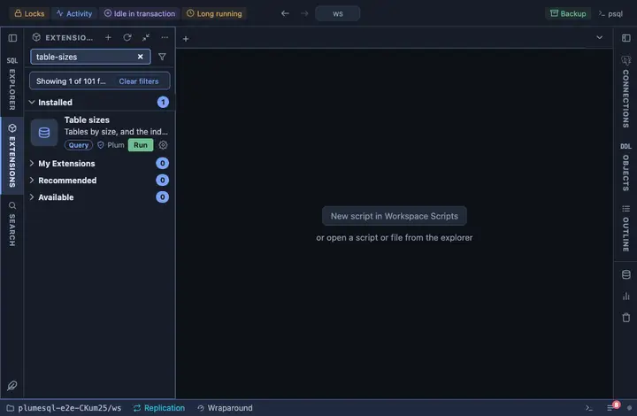

# Table sizes

Tables by size, all in, with the heap alone beside it, and the indexes
of any one of them one click away. Pinned under the right strip's tabs,
beside the object tree.

## What it shows

One row per table (partitioned parents included), the largest first:

| Column | Meaning |
|---|---|
| schema, table | The table. |
| total | On disk, all in: rows, indexes, TOAST. |
| heap | The rows alone. |

**Indexes** on a table opens a second grid with what makes up the rest:
each index, its size, how often it is read and its definition.

## Requirements

PostgreSQL 13 or newer.

## Notes

Reads only. The table's name and schema travel into the drill-down as
bound values, never pasted into the statement. Ships pinned to the right
strip under its tabs (`@toolbar right-below`).
