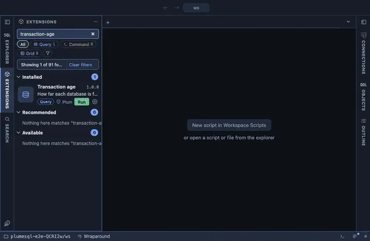

# Transaction age

How far each database is from transaction ID wraparound, and the tables
carrying the age on this one. A number that belongs in the status bar:
rarely looked at, never out of sight. The chip reads "Wraparound".

## What it shows

One row per database, the oldest first:

| Column | Meaning |
|---|---|
| database | Its name. |
| xid age | `age(datfrozenxid)`: how many transactions old its oldest unfrozen row is. |
| toward forced autovacuum | The age as a share of `autovacuum_freeze_max_age` (200 million by default); near 100% is routine, the forced vacuum handles it. |
| toward wraparound | The age as a share of two billion, where the server stops accepting writes; this one creeping up means vacuum is not keeping up. |

**Its oldest tables** on the current database opens the tables carrying
the age, oldest first, with their sizes. `relfrozenxid` is per table and
readable only locally, so to inspect another database from the list,
connect to it.

## Requirements

PostgreSQL 13 or newer.

## Notes

Reads only. Ships as a chip in the status bar (`@toolbar statusbar`).
