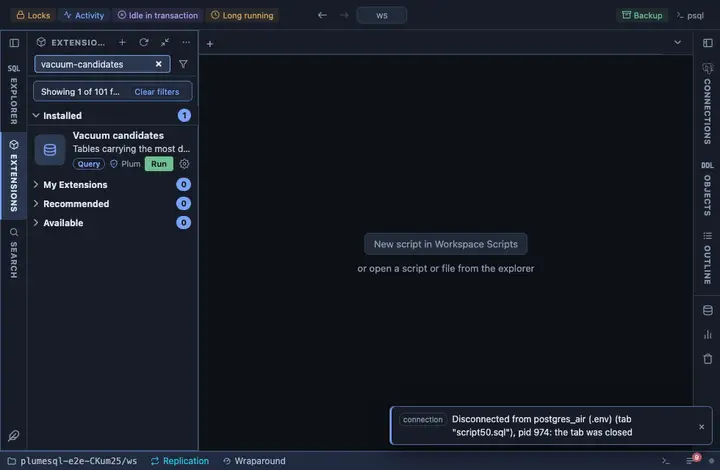

# Vacuum candidates

Tables carrying the most dead rows, with the dead share and when each
was last vacuumed and analyzed, and for any of them who is holding those
rows alive. Pinned under the right strip's tabs, beside the object tree.

## What it shows

One row per user table with dead rows, the most first:

| Column | Meaning |
|---|---|
| schema, table | The table. |
| live, dead | Rows the statistics see as live, and dead ones waiting for vacuum. |
| dead % | Dead rows as a share of live ones. |
| last vacuum, last analyze | The later of the manual and the automatic run, or `never`. |

**Who is holding it** on a table opens the backends of this database
holding a snapshot, oldest first, and says which of them also holds a
lock on this table. Vacuum cannot remove a row a snapshot older than
the row's death might still need, and that snapshot may belong to ANY
backend of the database, an idle-in-transaction session on another
table just the same; the one at the top is what every table is waiting
for. A replication slot or a prepared transaction holds rows too and
does not show here.

## Requirements

PostgreSQL 13 or newer. Seeing other users' statements in the
drill-down needs the `pg_read_all_stats` role or superuser.

## Notes

Reads only: nothing is vacuumed here. Ships pinned to the right strip
under its tabs (`@toolbar right-below`).
