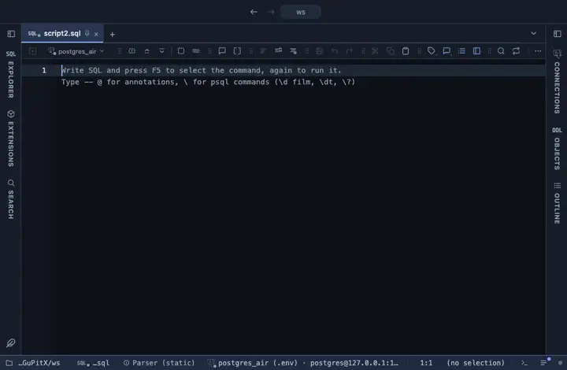

# Pivot

Rows by columns with a folded value and totals, over the whole result: one row per value of the row field, one column per value of the column field, each cell the value field folded into it, with totals down and across, listed in PlumeSQL's own result grid. Hand written, no library.

## What it shows

A **Pivot** tab beside the grid, itself a grid: the table is listed by the same component as the result, so it selects, copies in every shape, filters and exports like any result, and reads the same in both themes. It folds the whole result (a million rows in a pass) into a table capped at 500 rows by 60 columns; sort or filter in SQL to choose which. The columns come in order (numerically when the keys are numbers), an empty cell reads 0 for a count or a sum and stays blank for a mean, a min or a max, the totals row is frozen at the bottom and the row-field column at the start, in view while the rest scrolls (the Total column at the end too, when there is one).

## Inputs

| Input | `@inputs` key | Default | Meaning |
|---|---|---|---|
| Row field | `rows` | asked | Column whose values become the rows |
| Column field | `cols` | none | Column whose values become the columns; without one, a single total column |
| Value field | `value` | none | Numeric column folded into each cell; without one, a count of rows |
| Fold | `agg` | sum | How the values of one cell combine |
| Row order | `order` | by total | by total sorts the rows by their total; as seen keeps the order of the result |
| Top rows | `top` | 1000000 | How many rows the view reads from the result, from the first one; the rest are left out |

## Requirements

PostgreSQL 13 or newer. No server side: the result's sandbox draws it from the rows already fetched.

## Notes

Without a column field it is a single total column; without a value field it counts rows. A row per pair of columns is a SQL matter: select `a || ' · ' || b` as the row field. From a script: `-- @extension pivot` (plus `open`, `only` or `beside` for how the view opens) above the query, and `-- @inputs` to answer the inputs in the file so the dialog never shows. From a result: its own menu. The page has every line ready.
