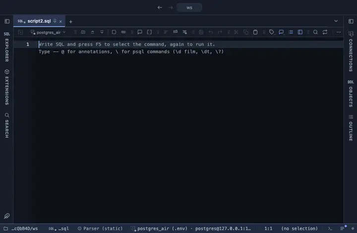

# Profile

Every column's nulls, distinct count, range, mean and distribution, over the whole result: the first thing to look at on a table you do not know. Hand written, no library.

## What it shows

A **Profile** tab beside the grid, itself a grid (the same component as the result, so it selects, copies, filters and exports like any result): one row per column with its type, how many NULLs and what share, how many distinct values, the smallest and largest, and for a number its mean and a histogram drawn in block characters, for text its length range and most common values. One pass over the whole result, a million rows.

## Inputs

| Input | `@inputs` key | Default | Meaning |
|---|---|---|---|
| Top rows | `top` | 1000000 | How many rows the view reads from the result, from the first one; the rest are left out |

## Requirements

PostgreSQL 13 or newer. Nothing on the server: the view runs in the result's sandbox.

## Notes

Run `select * from the_table` and open Profile; a LIMIT profiles the sample, not the table. Attach it from a script with `-- @extension profile` above a query (add `open`, `only` or `beside` to open on the view), or from a result's own menu; the extension's page in PlumeSQL lists the lines to paste, and `-- @inputs` answers the inputs in the file so the chart draws with no dialog.
