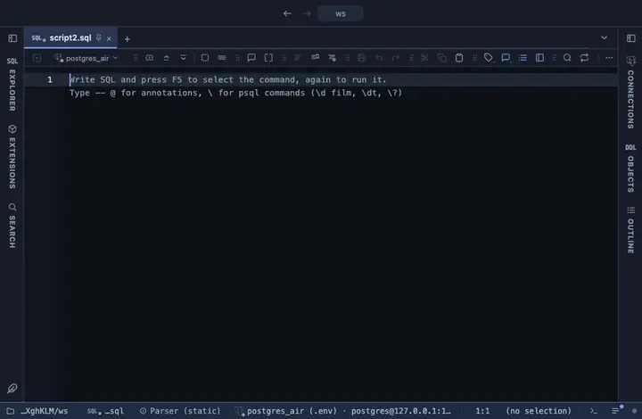

# Transpose

Columns become rows and rows become columns, one column per row of the result, in the grid. A wide row reads best as a column: psql's `\x` for the grid, over several rows side by side.

## What it shows

A **Transpose** tab beside the grid, itself a grid (the same component as the result, so it selects, copies, filters and exports like any result): one row per column of the result, with the column's name and type first, then one column per row of the result. The first column stays frozen while the rest scroll sideways. Compare two rows column by column, or read one wide row top to bottom.

## Inputs

| Input | `@inputs` key | Default | Meaning |
|---|---|---|---|
| Column names from | `names` | numbered | A column whose values name the new columns (a code, a key); repeats are numbered |
| Rows to turn | `top` | 60 | How many rows of the result become columns, from the first one (at most 500) |

## Requirements

PostgreSQL 13 or newer. No server side: the result's sandbox turns the rows already fetched.

## Notes

Made for a few wide rows, not for a long result: past a few dozen columns the grid scrolls sideways a lot, so narrow the query first. From a script: `-- @extension transpose open` above the query lands on the table after Run (`only` hides the grid, `beside` splits the two), or attach it from the result's menu; `-- @inputs names=airport_code` answers the input in the file so nothing asks. The page lists the lines.
