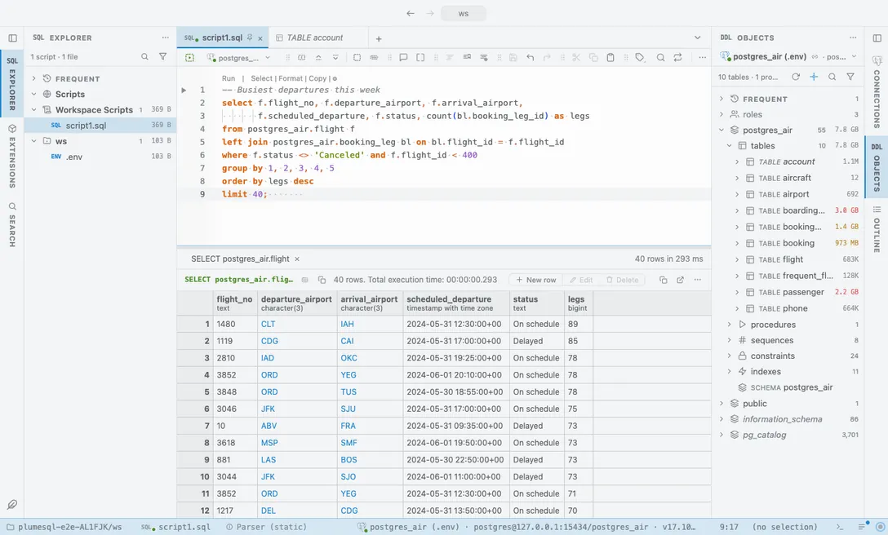

# Ayu

A simple, bright and elegant theme in three shades: Light, the dusky Mirage and the deep Dark.

## The themes

- **Ayu Light**, light
- **Ayu Mirage**, dark
- **Ayu Dark**, dark

## Use it

Install, then pick one in **Select Color Theme** (the cog menu, the command palette or its shortcut): the window repaints as the highlight moves, and Escape puts your theme back. The extension's page in the Extensions tab draws every theme as a small window with a **Use** button.

Everything follows the theme: the editor and its syntax colors, the object tree, the result grid, the terminal, and every chart view that paints with the palette it is handed.

## Credits

The palettes of [ayu](https://github.com/ayu-theme/ayu-colors) by Ike Ku and contributors (MIT); the light face darkens its accents a step so they read as text.
