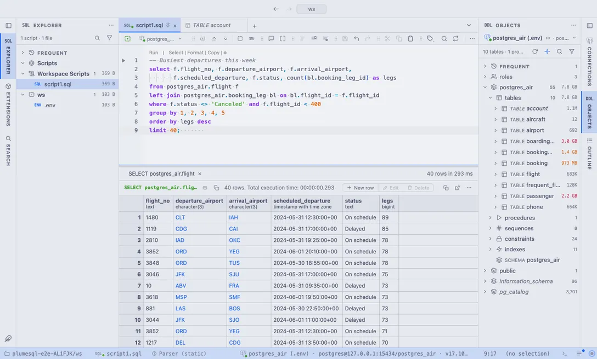

# Catppuccin

The soothing pastel family in all four flavors: Latte by day, Frappé, Macchiato and Mocha into the night.

## The themes

- **Catppuccin Latte**, light
- **Catppuccin Frappé**, dark
- **Catppuccin Macchiato**, dark
- **Catppuccin Mocha**, dark

## Use it

Install, then pick one in **Select Color Theme** (the cog menu, the command palette or its shortcut): the window repaints as the highlight moves, and Escape puts your theme back. The extension's page in the Extensions tab draws every theme as a small window with a **Use** button.

Everything follows the theme: the editor and its syntax colors, the object tree, the result grid, the terminal, and every chart view that paints with the palette it is handed.

## Credits

The palettes of [Catppuccin](https://catppuccin.com) by the Catppuccin organization (MIT); Latte darkens yellow and sky a step so they read as text.
