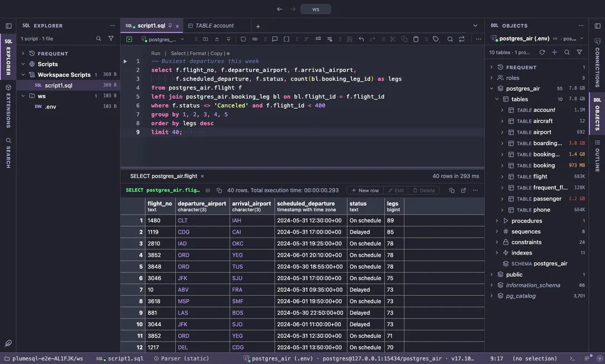

# Dracula

The famous dark theme: purple, pink and green on a deep blue-grey, high energy and very readable.

## The themes

- **Dracula**, dark

## Use it

Install, then pick it in **Select Color Theme** (the cog menu, the command palette or its shortcut): the window repaints as the highlight moves, and Escape puts your theme back. The extension's page in the Extensions tab draws the theme as a small window with a **Use** button.

Everything follows the theme: the editor and its syntax colors, the object tree, the result grid, the terminal, and every chart view that paints with the palette it is handed.

## Credits

The palette of the [Dracula Theme](https://draculatheme.com) by Zeno Rocha and contributors (MIT).
