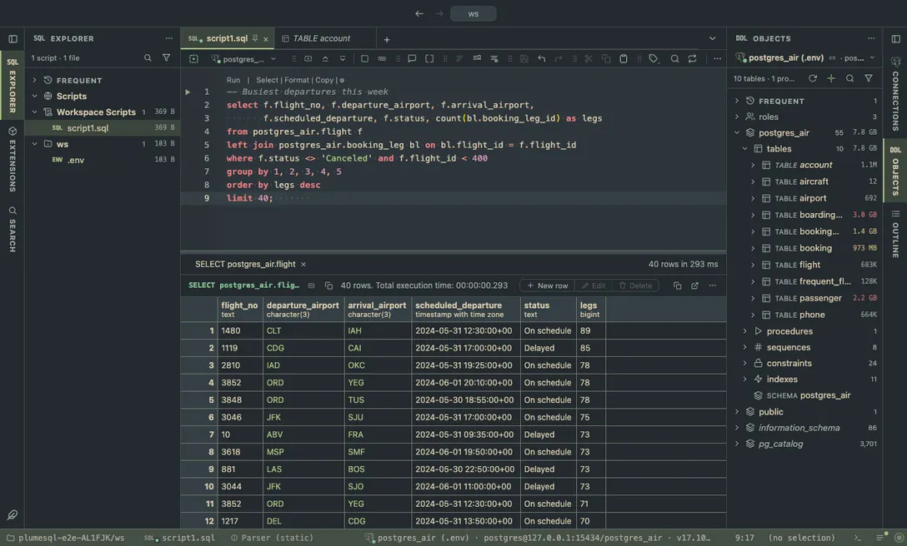

# Everforest

A green, forest-inspired scheme designed to be warm and soft for the eyes, dark and light.

## The themes

- **Everforest Dark**, dark
- **Everforest Light**, light

## Use it

Install, then pick one in **Select Color Theme** (the cog menu, the command palette or its shortcut): the window repaints as the highlight moves, and Escape puts your theme back. The extension's page in the Extensions tab draws every theme as a small window with a **Use** button.

Everything follows the theme: the editor and its syntax colors, the object tree, the result grid, the terminal, and every chart view that paints with the palette it is handed.

## Credits

The palettes of [Everforest](https://github.com/sainnhe/everforest) by sainnhe (MIT); the light face darkens its accents a step so they read as text.
