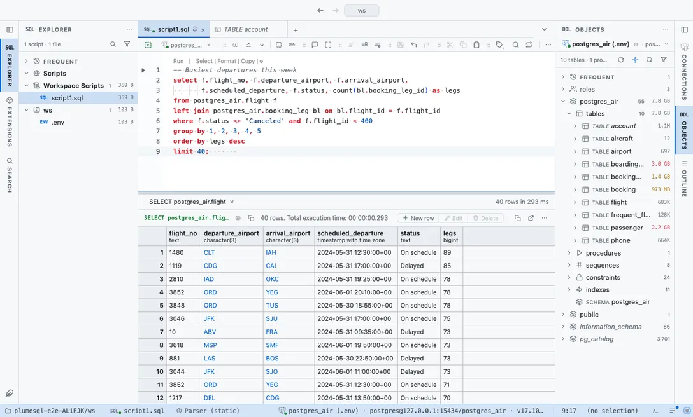

# GitHub

The colors you already read code in every day: GitHub Light, GitHub Dark and the softer Dark Dimmed.

## The themes

- **GitHub Light**, light
- **GitHub Dark**, dark
- **GitHub Dark Dimmed**, dark

## Use it

Install, then pick one in **Select Color Theme** (the cog menu, the command palette or its shortcut): the window repaints as the highlight moves, and Escape puts your theme back. The extension's page in the Extensions tab draws every theme as a small window with a **Use** button.

Everything follows the theme: the editor and its syntax colors, the object tree, the result grid, the terminal, and every chart view that paints with the palette it is handed.

## Credits

Colors after [GitHub's Primer](https://primer.style) and its VS Code theme (MIT). Not affiliated with GitHub.
