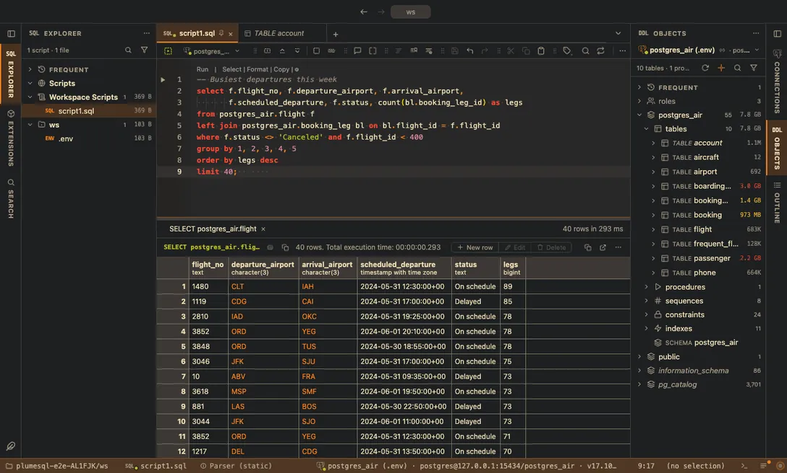

# Gruvbox

Retro groove colors, warm and earthy with low blue: the dark and the light face of the classic.

## The themes

- **Gruvbox Dark**, dark
- **Gruvbox Light**, light

## Use it

Install, then pick one in **Select Color Theme** (the cog menu, the command palette or its shortcut): the window repaints as the highlight moves, and Escape puts your theme back. The extension's page in the Extensions tab draws every theme as a small window with a **Use** button.

Everything follows the theme: the editor and its syntax colors, the object tree, the result grid, the terminal, and every chart view that paints with the palette it is handed.

## Credits

The palette of [gruvbox](https://github.com/morhetz/gruvbox) by Pavel Pertsev (MIT).
