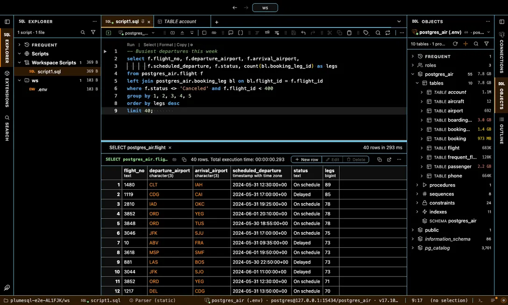

# High Contrast

Maximum legibility: pure black and pure white grounds, bright outlines around every focused control.

## The themes

- **High Contrast Dark**, dark, high contrast
- **High Contrast Light**, light, high contrast

## Use it

Install, then pick one in **Select Color Theme** (the cog menu, the command palette or its shortcut): the window repaints as the highlight moves, and Escape puts your theme back. The extension's page in the Extensions tab draws every theme as a small window with a **Use** button.

Everything follows the theme: the editor and its syntax colors, the object tree, the result grid, the terminal, and every chart view that paints with the palette it is handed.

## Credits

After VS Code's own high contrast themes; Monaco draws on its high contrast base, which outlines focused and hovered widgets.
