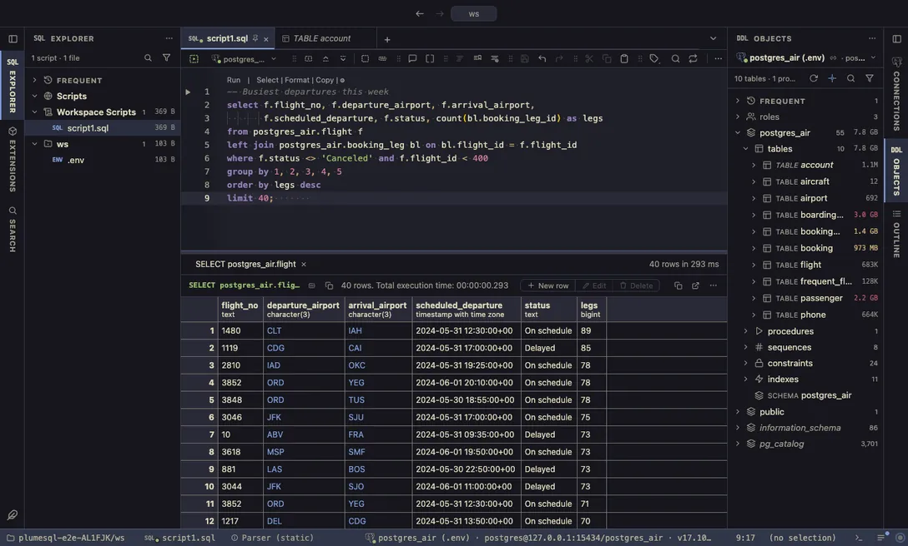

# Kanagawa

Inspired by the colors of Katsushika Hokusai's famous painting: Wave by night, Lotus by day.

## The themes

- **Kanagawa Wave**, dark
- **Kanagawa Lotus**, light

## Use it

Install, then pick one in **Select Color Theme** (the cog menu, the command palette or its shortcut): the window repaints as the highlight moves, and Escape puts your theme back. The extension's page in the Extensions tab draws every theme as a small window with a **Use** button.

Everything follows the theme: the editor and its syntax colors, the object tree, the result grid, the terminal, and every chart view that paints with the palette it is handed.

## Credits

The palettes of [kanagawa.nvim](https://github.com/rebelot/kanagawa.nvim) by rebelot (MIT).
