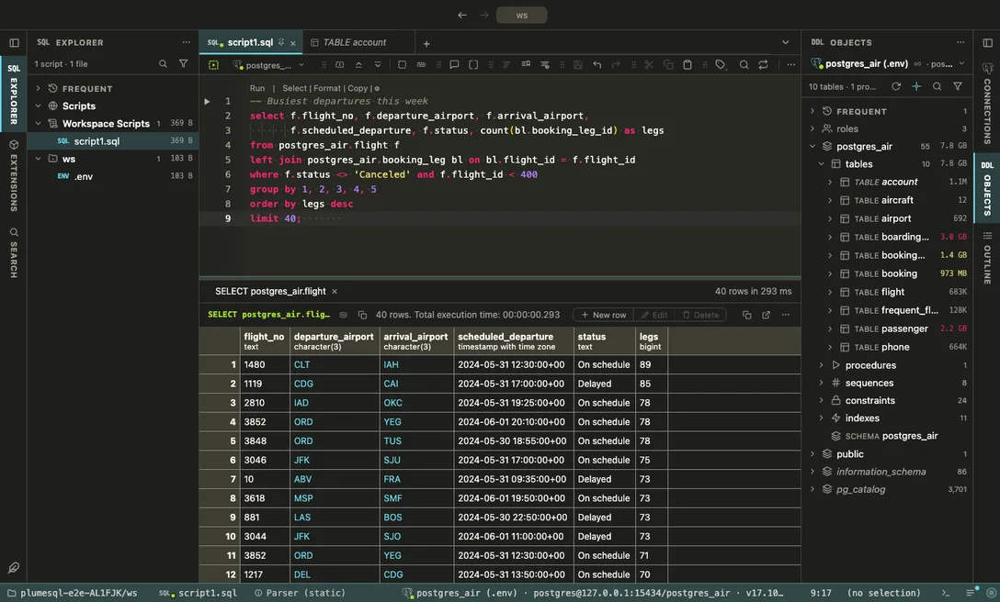

# Monokai

The classic of text editors: electric pink, lime and violet on warm charcoal.

## The themes

- **Monokai**, dark

## Use it

Install, then pick it in **Select Color Theme** (the cog menu, the command palette or its shortcut): the window repaints as the highlight moves, and Escape puts your theme back. The extension's page in the Extensions tab draws the theme as a small window with a **Use** button.

Everything follows the theme: the editor and its syntax colors, the object tree, the result grid, the terminal, and every chart view that paints with the palette it is handed.

## Credits

After the Monokai color scheme by Wimer Hazenberg, as the VS Code built-in carries it.
