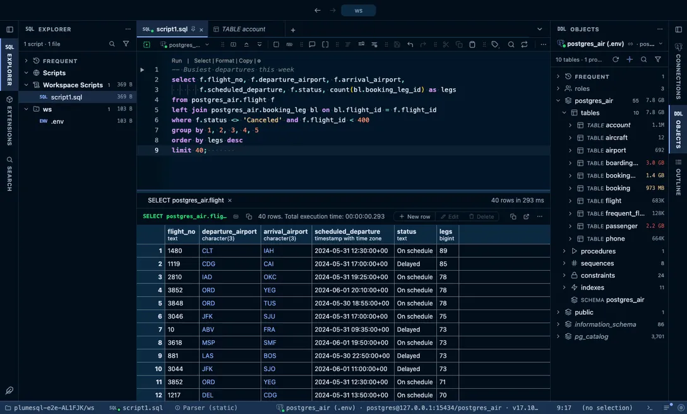

# Night Owl

Fine tuned for those of us who like to code late into the night, and its Light Owl for the morning after.

## The themes

- **Night Owl**, dark
- **Light Owl**, light

## Use it

Install, then pick one in **Select Color Theme** (the cog menu, the command palette or its shortcut): the window repaints as the highlight moves, and Escape puts your theme back. The extension's page in the Extensions tab draws every theme as a small window with a **Use** button.

Everything follows the theme: the editor and its syntax colors, the object tree, the result grid, the terminal, and every chart view that paints with the palette it is handed.

## Credits

The palettes of [Night Owl](https://github.com/sdras/night-owl-vscode-theme) by Sarah Drasner (MIT).
