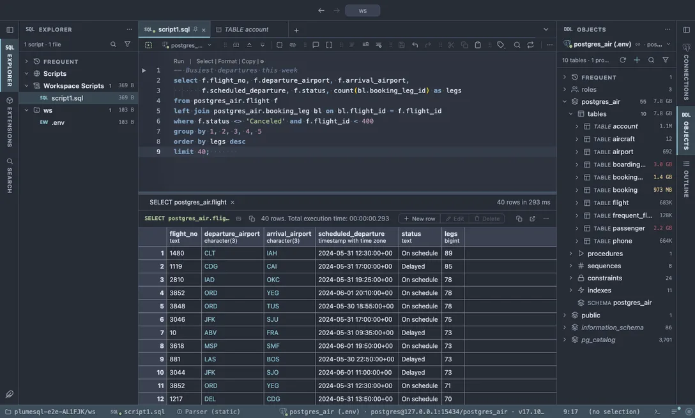

# Nord

An arctic, north-bluish dark theme: calm frost blues on polar night grey, easy on long sessions.

## The themes

- **Nord**, dark

## Use it

Install, then pick it in **Select Color Theme** (the cog menu, the command palette or its shortcut): the window repaints as the highlight moves, and Escape puts your theme back. The extension's page in the Extensions tab draws the theme as a small window with a **Use** button.

Everything follows the theme: the editor and its syntax colors, the object tree, the result grid, the terminal, and every chart view that paints with the palette it is handed.

## Credits

The palette of [Nord](https://www.nordtheme.com) by Arctic Ice Studio and Sven Greb (MIT).
