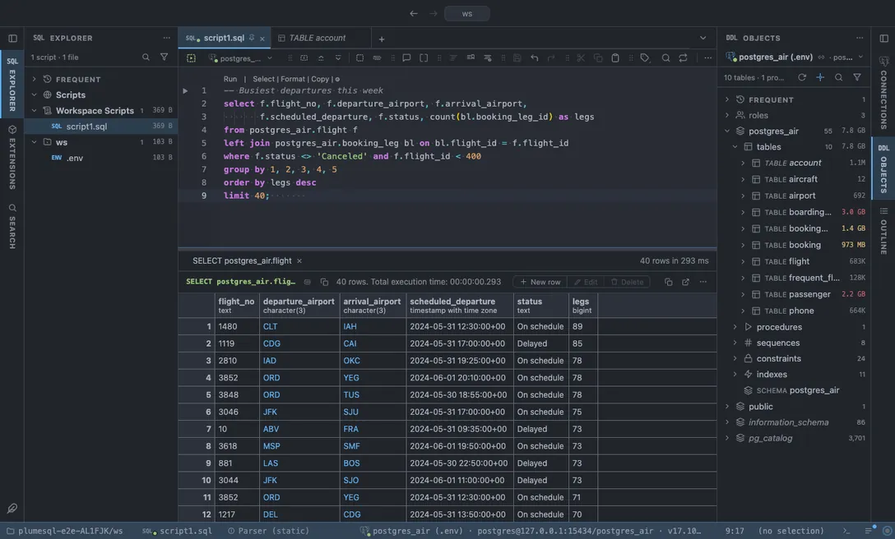

# One Dark and Light

Atom's beloved pair, the most installed dark theme there is and its bright twin.

## The themes

- **One Dark**, dark
- **One Light**, light

## Use it

Install, then pick one in **Select Color Theme** (the cog menu, the command palette or its shortcut): the window repaints as the highlight moves, and Escape puts your theme back. The extension's page in the Extensions tab draws every theme as a small window with a **Use** button.

Everything follows the theme: the editor and its syntax colors, the object tree, the result grid, the terminal, and every chart view that paints with the palette it is handed.

## Credits

The palettes of Atom's One Dark and One Light (MIT) as One Dark Pro carries them on.
