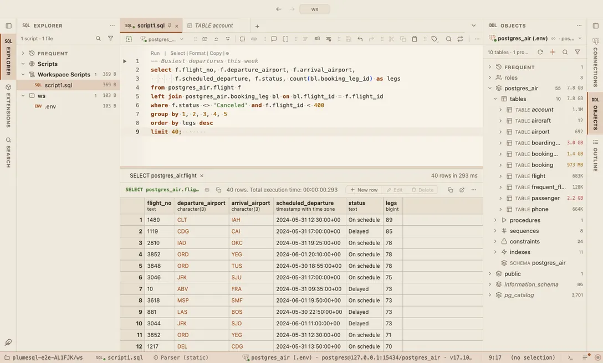

# PlumeSQL Originals

Four themes made for PlumeSQL: warm Paper, neutral Graphite, the elephant blue Harbor and a dark roast Espresso.

## The themes

- **Paper**, light
- **Graphite**, dark
- **Harbor**, dark
- **Espresso**, dark

## Use it

Install, then pick one in **Select Color Theme** (the cog menu, the command palette or its shortcut): the window repaints as the highlight moves, and Escape puts your theme back. The extension's page in the Extensions tab draws every theme as a small window with a **Use** button.

Everything follows the theme: the editor and its syntax colors, the object tree, the result grid, the terminal, and every chart view that paints with the palette it is handed.

## Credits

Made for PlumeSQL. Harbor takes its blue from the elephant; Paper reads like a printed page.
