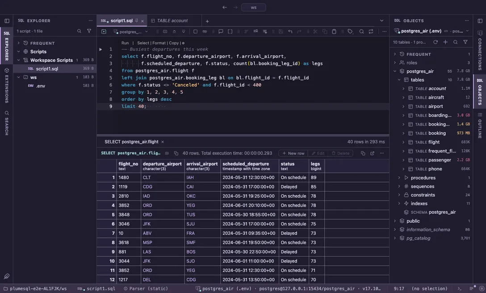

# Rosé Pine

All natural pine, faux fur and a bit of soho vibes: Rosé Pine, the dimmer Moon and the light Dawn.

## The themes

- **Rosé Pine**, dark
- **Rosé Pine Moon**, dark
- **Rosé Pine Dawn**, light

## Use it

Install, then pick one in **Select Color Theme** (the cog menu, the command palette or its shortcut): the window repaints as the highlight moves, and Escape puts your theme back. The extension's page in the Extensions tab draws every theme as a small window with a **Use** button.

Everything follows the theme: the editor and its syntax colors, the object tree, the result grid, the terminal, and every chart view that paints with the palette it is handed.

## Credits

The palettes of [Rosé Pine](https://rosepinetheme.com) by the Rosé Pine organization (MIT); keywords take Pine a step brighter so they read at night.
