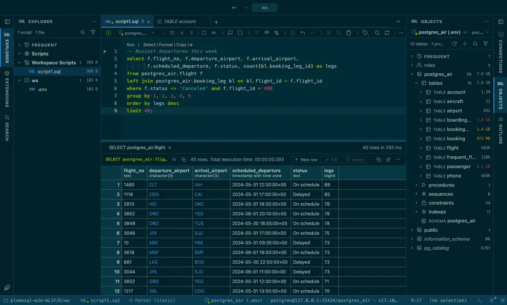

# Solarized

Ethan Schoonover's precision palette in both faces: the same sixteen colors read on a dark and a light ground.

## The themes

- **Solarized Dark**, dark
- **Solarized Light**, light

## Use it

Install, then pick one in **Select Color Theme** (the cog menu, the command palette or its shortcut): the window repaints as the highlight moves, and Escape puts your theme back. The extension's page in the Extensions tab draws every theme as a small window with a **Use** button.

Everything follows the theme: the editor and its syntax colors, the object tree, the result grid, the terminal, and every chart view that paints with the palette it is handed.

## Credits

The palette of [Solarized](https://ethanschoonover.com/solarized/) by Ethan Schoonover (MIT); the light face darkens a few accents so they read as text.
