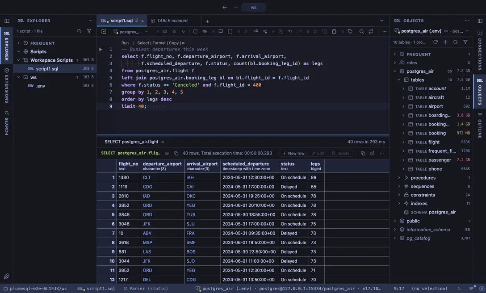

# Tokyo Night

Downtown Tokyo at night, in three versions: Night, the softer Storm and the bright Day.

## The themes

- **Tokyo Night**, dark
- **Tokyo Night Storm**, dark
- **Tokyo Night Day**, light

## Use it

Install, then pick one in **Select Color Theme** (the cog menu, the command palette or its shortcut): the window repaints as the highlight moves, and Escape puts your theme back. The extension's page in the Extensions tab draws every theme as a small window with a **Use** button.

Everything follows the theme: the editor and its syntax colors, the object tree, the result grid, the terminal, and every chart view that paints with the palette it is handed.

## Credits

The palettes of [Tokyo Night](https://github.com/enkia/tokyo-night-vscode-theme) by enkia and folke's ports (MIT).
