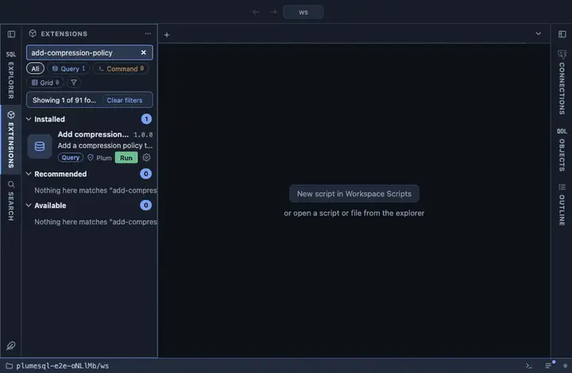

# Add compression policy

Add a compression policy to the hypertable this was opened on: chunks
older than an age you give get compressed by a TimescaleDB background
job. From a hypertable's row in the object tree; it asks for the age,
then confirms.

## What it does

Asks how old a chunk must be, confirms, then calls
`add_compression_policy(hypertable, compress_after => age,
if_not_exists => true)`. The answer is the job's id; `-1` says a policy
already existed and was left as it is.

## Inputs

| Input | Default | Meaning |
|---|---|---|
| compress_after | 7 days | Compress chunks older than this interval. |

## Requirements

PostgreSQL 13 or newer with the `timescaledb` extension; without it the run answers with the server's own error. Compression must be enabled on the hypertable first (`ALTER TABLE …
SET (timescaledb.compress)`); the question says so. Ownership of the
hypertable.

## Notes

A writing extension: it schedules work on the server and asks first
(`@confirm`). An `@for hypertable` extension; `{object}` is the table it
was opened on, bound as a parameter. The function is the extension's own
and deliberately not schema qualified.
