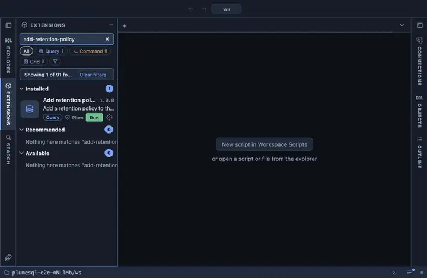

# Add retention policy

Add a retention policy to the hypertable this was opened on: chunks
older than an age you give get DROPPED by a TimescaleDB background job.
From a hypertable's row in the object tree; it asks for the age, then
confirms in words that say what is lost.

## What it does

Asks how old a chunk must be, confirms, then calls
`add_retention_policy(hypertable, drop_after => age, if_not_exists =>
true)`. The answer is the job's id; `-1` says a policy already existed
and was left as it is.

## Inputs

| Input | Default | Meaning |
|---|---|---|
| drop_after | 90 days | Drop chunks older than this interval. |

## Requirements

PostgreSQL 13 or newer with the `timescaledb` extension; without it the run answers with the server's own error. Ownership of the hypertable.

## Notes

A writing extension that destroys data over time, which is why the
question names it: dropped chunks are gone with their rows, while a
continuous aggregate over the hypertable keeps what it materialized. An
`@for hypertable` extension; `{object}` is bound as a parameter. The
function is the extension's own and deliberately not schema qualified.
