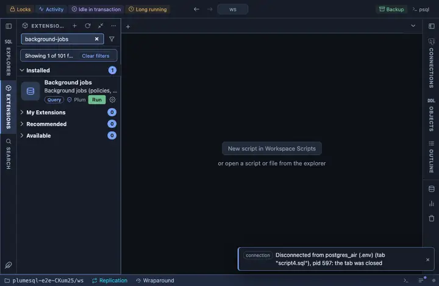

# Background jobs

TimescaleDB's background jobs, policies and refreshes alike, with their
schedule and run record, and any job's run history with its errors
verbatim one click away. The place to look when a policy stopped doing
its work.

## What it shows

One row per job:

| Column | Meaning |
|---|---|
| id, job | The job and its name (the policy or the user action). |
| hypertable | What it works on, when it is bound to one. |
| every | Its schedule interval. |
| enabled | Whether it is scheduled to run. |
| last run, started | The last run's status and start. |
| runs, failures | The totals since the job was created. |
| next_start | When it runs next. |

**Run history** on a job opens its runs, newest first, failures with
their SQLSTATE and message verbatim (the `job_history` view arrived in
TimescaleDB 2.15; an older server answers with its own words).

## Requirements

PostgreSQL 13 or newer with the `timescaledb` extension; without it the run answers with the server's own error.

## Notes

Reads only. The `timescaledb_information` views are deliberately not
schema qualified: they live where the extension was installed.
