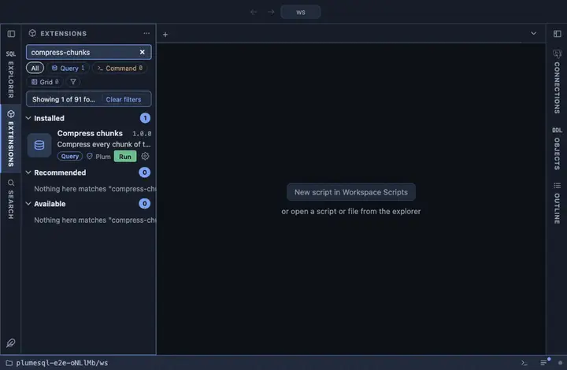

# Compress chunks

Compress every chunk of the hypertable this was opened on that is not
compressed yet, now, in one run. From a hypertable's row in the object
tree; it asks first.

## What it does

Confirms, then calls `compress_chunk(chunk, if_not_compressed => true)`
for every chunk `show_chunks` lists. Each row of the answer is one chunk
this run compressed; a chunk already compressed is skipped rather than
an error.

## Requirements

PostgreSQL 13 or newer with the `timescaledb` extension; without it the run answers with the server's own error. Compression must be enabled on the hypertable first (`ALTER TABLE …
SET (timescaledb.compress)`). Ownership of the hypertable.

## Notes

A writing extension: it asks before it runs (`@confirm`), and the
question says that a compressed chunk is read-only until decompressed.
An `@for hypertable` extension; `{object}` is bound as a parameter. The
functions are the extension's own and deliberately not schema
qualified. For an ongoing schedule use Add compression policy instead.
