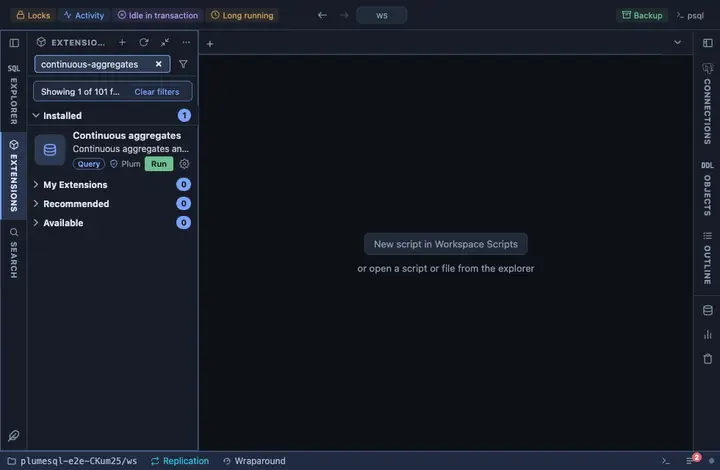

# Continuous aggregates

TimescaleDB's continuous aggregates and the hypertables they roll up,
whether each is materialized only and compressed, and any aggregate's
defining query one click away.

## What it shows

One row per continuous aggregate:

| Column | Meaning |
|---|---|
| schema, view | The aggregate. |
| over hypertable | The hypertable it rolls up. |
| materialized only | Whether reads return the materialized data alone, or also the newest raw rows. |
| compression | Whether its materialization is compressed. |

**Definition** on a view opens the aggregate's defining query, as the
server holds it.

## Requirements

PostgreSQL 13 or newer with the `timescaledb` extension; without it the run answers with the server's own error.

## Notes

Reads only. The refresh policies that keep an aggregate current show
under Background jobs and, per aggregate, under Hypertable policies.
