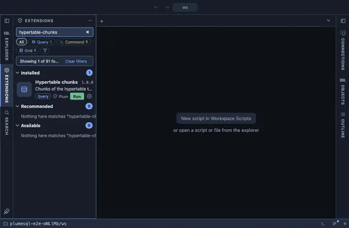

# Hypertable chunks

The chunks of the hypertable this was opened on: the time range each
covers, its size, whether it is compressed and its tablespace, newest
first. From a hypertable's row in the object tree.

## What it shows

One row per chunk:

| Column | Meaning |
|---|---|
| chunk | The chunk's name. |
| from, to | The range of the partitioning dimension it covers. |
| size | On disk, all in. |
| compressed | Whether it is compressed. |
| tablespace | Where it lives, when not the default. |

## Requirements

PostgreSQL 13 or newer with the `timescaledb` extension; without it the run answers with the server's own error.

## Notes

Reads only. An `@for hypertable` extension: `{schema}` and `{name}` are
the table it was opened on, bound as parameters.
