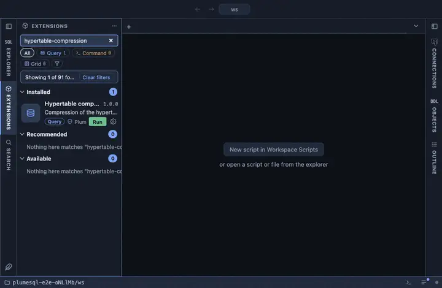

# Hypertable compression

The compression of the hypertable this was opened on: how many chunks
are compressed, the bytes before and after, the ratio, and the same for
the heap and the indexes apart. From a hypertable's row in the object
tree; the number that says whether compression was worth turning on.

## What it shows

One row for the hypertable:

| Column | Meaning |
|---|---|
| chunks, compressed_chunks | How many chunks, and how many of them are compressed. |
| before, after, ratio | Total bytes before and after compression, and the ratio. |
| heap_before, heap_after | The rows alone. |
| indexes_before, indexes_after | The indexes alone. |

Before any chunk is compressed the byte columns are empty: nothing has
been measured yet.

## Requirements

PostgreSQL 13 or newer with the `timescaledb` extension; without it the run answers with the server's own error.

## Notes

Reads only. An `@for hypertable` extension; `{object}` is bound as a
parameter. The stats function is the extension's own and deliberately
not schema qualified.
